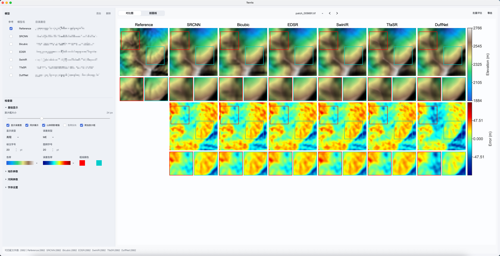

# Terrix

Terrix 是一个面向 DEM 结果对比与可视化分析的桌面工具。适合用来比较多个模型输出的地形栅格结果，把同名 `tif/tiff` 样本自动对齐后进行并排预览、局部放大、坡度/坡向派生分析、误差图查看，以及高分辨率图片导出。

## 核心功能

### 多模型 DEM 对比

- 支持同时导入多个模型结果目录
- 支持设置参考数据
- 自动匹配不同模型目录中的同名 `tif/tiff` 样本
- 支持模型顺序调整、路径修改与列表管理

### 多种地形表达方式

- 高程可视化
- 坡度可视化
- 坡向可视化
- 色带切换
- 误差图显示

### 局部放大与同步观察

- 在总览图中拖动放大框
- 下方自动显示对应局部区域
- 所有模型使用统一放大位置，方便横向比较细节差异

### 山体阴影增强

- 每个模型基于自己的 DEM 单独计算 hillshade
- 不是简单透明度叠加，而是将伪彩色 DEM 与阴影结果做光照混合
- 更适合观察地形起伏、纹理和微地貌结构

### 河网叠加分析

- 支持基于 DEM 结果提取河网并叠加显示
- 支持流量阈值、河网线宽、点大小、颜色等参数调整
- 支持填洼选项

### 精度评估

Terrix 内置了统一的精度评估模块，可按样本批量计算并导出结果。

支持指标：

- `mIoU`
- `PSNR`
- `SSIM`
- `RMSE`
- `MAE`
- `ME`

支持评估对象：

- 高程
- 坡度
- 坡向

其中：

- `mIoU` 始终基于 DEM 河网提取结果计算
- 其余 5 个指标基于当前选择的高程 / 坡度 / 坡向进行计算
- 坡向评估支持“是否考虑循环误差（0°=360°）”选项

导出结果包括：

- 每个指标一个逐图像 CSV
- 一个汇总 CSV
- 汇总结果包含各模型平均值及 `95%` 置信区间

### 高分辨率导出

- 支持导出当前对比图
- 支持 `png / jpg / pdf / tif`
- 支持自定义导出 DPI
- 适合论文插图、报告图和结果展示

## 使用流程

1. 导入多个模型目录，并指定参考模型  
2. 选择同名样本进行比较  
3. 在高程 / 坡度 / 坡向之间切换  
4. 使用放大框查看局部细节  
5. 按需叠加河网、开启误差图或山体阴影增强  
6. 导出当前图像，或执行批量精度评估并导出 CSV

## 适用场景

- DEM 超分辨率结果对比
- 地形重建实验可视化检查
- 多模型推理结果横向比较
- 河网恢复能力分析
- 论文图、汇报图快速生成

## 平台与运行

当前项目主要面向桌面端使用，核心实现基于 Java 17 与 Swing。
